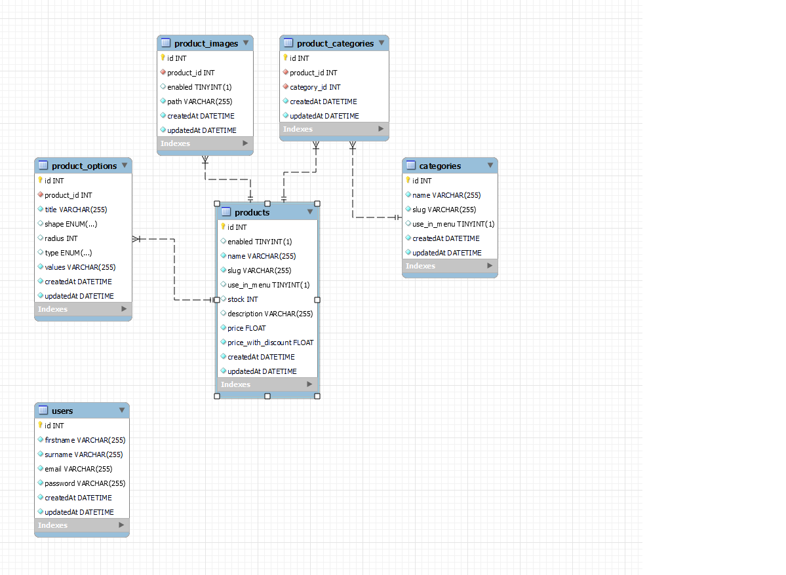

## API hospedada
```
https://api-digital-store.onrender.com/v1/product/1
```
1. Como usar?
<details>
  <summary><strong> Fazer uma requisição GET:</strong></summary><br>

 Para acessar os dados do produto com ID 1, você precisa fazer uma requisição do tipo GET para a URL fornecida:

- URL: https://api-digital-store.onrender.com/v1/product/1
- Método HTTP: GET
- Resposta da API: Quando a requisição for feita corretamente, a API retornará uma resposta em formato JSON, contendo informações detalhadas sobre o produto. Isso pode incluir o nome do produto, descrição, preço, estoque disponível, etc.


</details>


## 📋 Requirements

- Node.js (v12 ou posterior)
- npm (v6 ou posterior) ou yarn (v1 ou posterior)

## 🔧 Installation

1. Clone o repositório:

```
git clone https://github.com/Geracao-Tech-2024/api-digital-store.git
```

2. Instale as dependências:

```
npm install

```

3. Crie dentro da pasta do projeto clonado o arquivo .ENV, passando estes dados:

```
DB_NAME = railway
DB_USER = root
DB_PASS = NcNqyjbOYKMwCrkfJOYQYXyvtDsgescv
DB_HOST = monorail.proxy.rlwy.net
DB_PORT = 24130
SECRET_JWT = JW_Inglish_or_spanish?T
```

4. Baixe o arquivo sql, que está no projeto, importe-o para dbeaver ou workbench para executar as tabelas ja criadas.

```
esquema banco .mwb
```


5. Execute o servidor de desenvolvimento:

```
npm start
```
## 🔧 Installing Test Dependencies

1. Para garantir que todas as dependências necessárias para os testes sejam instaladas corretamente, siga os passos abaixo:

2. Primeiro instale o Jest para a para configurar um ambiente de testes unitários, permitindo verificar o comportamento das funções e módulos isoladamente, facilitando a detecção e correção de erros: 

```
npm install --save-dev jest

```
3. Em seguida instale o Supertest para realizar testes de integração, simulando requisições HTTP e verificando as respostas das rotas e APIs, garantindo que a aplicação funcione corretamente:

```
npm install --save-dev supertest

```


## 🛠️  Estrutura do Projeto

```
project-root/
├── src/
│   ├── config/
│   ├── controllers/
│   ├── middleware/
│   ├── models/
│   ├── routes/
│   ├── services/
│   ├── app.js
│   └── server.js
├── tests/integracao
├── .env
├── .gitignore
├── package-lock.json
└── package.json

```
## 🛠️  Schema do banco de dados



## Seção 01 - Criação do banco de dados

<details>
   <summary><strong>Criar o Database</strong></summary><br>

Criar o banco de dados:

```
CREATE DATABASE railway
```


       
</details>

## Seção 02 - Criação das tabelas do banco de dados

<details>
   <summary><strong>Criar a tabela de usuários</strong></summary><br>

Criar a tabela de usuários no banco de dados utilizando o Sequelize ORM. A tabela contém as colunas a seguir:

- **id**: Coluna do tipo INTEGER 
- **firstname**: Coluna do tipo STRING 
- **surname**: Coluna do tipo STRING 
- **email**: Coluna do tipo STRING 
- **password**: Coluna do tipo STRING

  -- railway.users definition


  ```
   CREATE TABLE users (
     id int NOT NULL AUTO_INCREMENT,
     firstname varchar(255) NOT NULL,
     surname varchar(255) NOT NULL,
     email varchar(255) NOT NULL,
     password varchar(255) NOT NULL,
     createdAt datetime NOT NULL,
     updatedAt datetime NOT NULL,
     PRIMARY KEY (id),
     UNIQUE KEY email (email),
     UNIQUE KEY email_2 (email),
     UNIQUE KEY email_3 (email),
     UNIQUE KEY email_4 (email),
     UNIQUE KEY email_5 (email),
     UNIQUE KEY email_6 (email),
     UNIQUE KEY email_7 (email),
     UNIQUE KEY email_8 (email),
     UNIQUE KEY email_9 (email),
     UNIQUE KEY email_10 (email),
   ) ENGINE=InnoDB AUTO_INCREMENT=46 DEFAULT CHARSET=utf8mb4 COLLATE=utf8mb4_0900_ai_ci;
   ```


</details>

<details>
  <summary><strong>Criar a tabela de produtos</strong></summary><br>

 Criar a tabela de produtos no banco de dados utilizando o Sequelize ORM. A tabela contém as colunas a seguir:

- **id**: Coluna do tipo INTEGER 
- **enabled**: Coluna do tipo BOOLEAN 
- **name**: Coluna do tipo STRING 
- **slug**: Coluna do tipo STRING 
- **use_in_menu**: Coluna do tipo BOOLEAN 
- **stock**: Coluna do tipo INTEGER 
- **description**: Coluna do tipo STRING 
- **price**: Coluna do tipo FLOAT 
- **price_with_discount**: Coluna do tipo FLOAT

 -- railway.products definition
  ```
  

   CREATE TABLE products (
     id int NOT NULL AUTO_INCREMENT,
     enabled tinyint(1) DEFAULT '0',
     name varchar(255) NOT NULL,
     slug varchar(255) NOT NULL,
     use_in_menu tinyint(1) DEFAULT '0',
     stock int DEFAULT '0',
     description varchar(255) DEFAULT NULL,
     price float NOT NULL,
     price_with_discount float NOT NULL,
     createdAt datetime NOT NULL,
     updatedAt datetime NOT NULL,
     PRIMARY KEY (id)
   ) ENGINE=InnoDB AUTO_INCREMENT=17 DEFAULT CHARSET=utf8mb4 COLLATE=utf8mb4_0900_ai_ci;
   ```

</details>

<details>
  <summary><strong> Criar a tabela de categorias</strong></summary><br>

 Criar a tabela de categorias no banco de dados utilizando o Sequelize ORM. A tabela deve conter as colunas a seguir:

- **id**: Coluna do tipo INTEGER 
- **name**: Coluna do tipo STRING 
- **slug**: Coluna do tipo STRING
- **use_in_menu**: Coluna do tipo BOOLEAN

-- railway.categories definition

   ```
   CREATE TABLE categories (
     id int NOT NULL AUTO_INCREMENT,
     name varchar(255) NOT NULL,
     slug varchar(255) NOT NULL,
     use_in_menu tinyint(1) DEFAULT '0',
     createdAt datetime NOT NULL,
     updatedAt datetime NOT NULL,
     PRIMARY KEY (id)
   ) ENGINE=InnoDB AUTO_INCREMENT=49 DEFAULT CHARSET=utf8mb4 COLLATE=utf8mb4_0900_ai_ci;
   
   ```

</details>

<details>
  <summary><strong>Criar a tabela de imagens do produto</strong></summary><br>
   
Criar a tabela de imagens dos produtos no banco de dados utilizando o Sequelize ORM. A tabela deve conter as colunas a seguir:

- **id**: Coluna do tipo INTEGER 
- **product_id**: Coluna do tipo INTEGER 
- **enabled**: Coluna do tipo BOOLEAN 
- **path**: Coluna do tipo STRING

  -- railway.product_images definition

     ```
      CREATE TABLE product_images (
     id int NOT NULL AUTO_INCREMENT,
     product_id int NOT NULL,
     enabled tinyint(1) DEFAULT '0',
     path varchar(255) NOT NULL,
     createdAt datetime NOT NULL,
     updatedAt datetime NOT NULL,
     PRIMARY KEY (id),
     KEY product_id (product_id),
     CONSTRAINT product_images_ibfk_1 FOREIGN KEY (product_id) REFERENCES products (id) ON UPDATE CASCADE
   ) ENGINE=InnoDB AUTO_INCREMENT=50 DEFAULT CHARSET=utf8mb4 COLLATE=utf8mb4_0900_ai_ci;

   ```
</details>

<details>
  <summary><strong>Criar a tabela de opções do produto</strong></summary><br>

Criar a tabela de opções do produto no banco de dados utilizando o Sequelize ORM. A tabela deve conter as colunas a seguir:

- **id**: Coluna do tipo INTEGER 
- **product_id**: Coluna do tipo INTEGER 
- **title**: Coluna do tipo STRING 
- **shape**: Coluna do tipo ENUM 
- **radius**: Coluna do tipo INTEGER 
- **type**: Coluna do tipo ENUM 
- **values**: Coluna do tipo STRING

  -- railway.product_options definition

     ```
      CREATE TABLE product_options (
     id int NOT NULL AUTO_INCREMENT,
     product_id int NOT NULL,
     title varchar(255) NOT NULL,
     shape enum('square','circle') DEFAULT 'square',
     radius int DEFAULT '0',
     type enum('text','color') DEFAULT 'text',
     values varchar(255) NOT NULL,
     createdAt datetime NOT NULL,
     updatedAt datetime NOT NULL,
     PRIMARY KEY (id),
     KEY product_id (product_id),
     CONSTRAINT product_options_ibfk_1 FOREIGN KEY (product_id) REFERENCES products (id) ON UPDATE CASCADE
   ) ENGINE=InnoDB AUTO_INCREMENT=30 DEFAULT CHARSET=utf8mb4 COLLATE=utf8mb4_0900_ai_ci;
   ```


</details>
